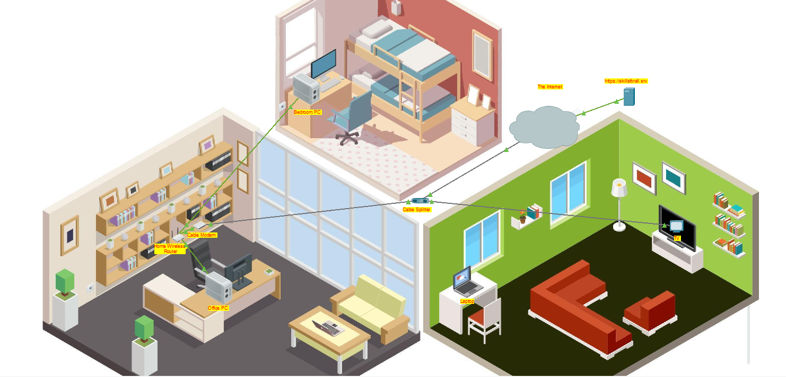
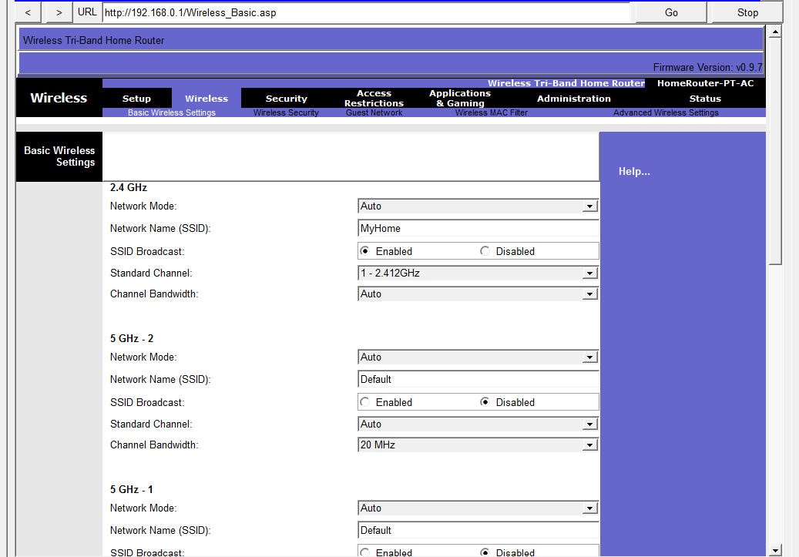
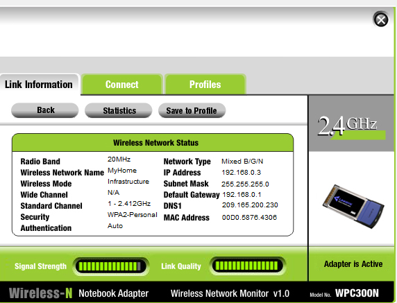

# 🏠 Laboratório 1 - Criação de uma Rede Doméstica

Atividade prática do **Cisco Packet Tracer**, realizada durante o curso **Conceitos Básicos de Redes**, com o objetivo de construir e configurar uma rede doméstica com conexões cabeadas e sem fio.

---

## 📷 Topologia da Rede



---

## 🎯 Objetivos

- Conectar os dispositivos de uma rede doméstica
- Configurar um roteador sem fio
- Configurar uma rede Wi-Fi
- Utilizar DHCP para endereçamento IP
- Configurar segurança WPA2
- Testar a conectividade com a Internet

---

## 🌐 Estrutura da Rede

A rede foi construída utilizando:

- **Cable Splitter** para separar os serviços de Internet e TV
- **Cable Modem** para conexão com o provedor
- **Home Wireless Router** como ponto central da rede
- **Office PC** e **Bedroom PC** conectados por Ethernet
- **Laptop** conectado via Wi-Fi
- **TV** conectada ao serviço de vídeo
- Conexão com a **Internet**

### 🔌 Conexões

- Cable Splitter → Cable Modem: cabo coaxial
- Cable Splitter → TV: cabo coaxial
- Cable Modem → Wireless Router: cabo Ethernet
- PCs → Wireless Router: cabo Ethernet
- Laptop → Wireless Router: Wi-Fi

---

## ⚙️ Configurações Realizadas

### Roteador

- DHCP configurado para distribuir endereços IP
- Limite de até 10 dispositivos conectados
- Credenciais administrativas alteradas
- Rede Wi-Fi configurada com o SSID `MyHome`
- Segurança **WPA2 Personal** habilitada



### Dispositivos

Os computadores foram configurados para obter automaticamente seus endereços IP através do **DHCP**.

O laptop foi conectado à rede Wi-Fi utilizando o SSID e a chave de segurança configurados no roteador.



---

## 🧪 Testes de Conectividade

A conectividade foi verificada através do acesso ao servidor:

```text
skillsforall.srv
```
O acesso foi testado pelo:

Laptop
Office PC
Bedroom PC

Todos os dispositivos foram configurados para acessar a Internet através do roteador.

## 🧠 Conceitos Praticados
- Rede doméstica
- LAN e WLAN
- Roteador sem fio
- Cable Modem
- DHCP
- Endereço IPv4
- Gateway padrão
- SSID
- Wi-Fi
- WPA2
- Conexões Ethernet e coaxial
- Conectividade com a Internet

## 📌 O que aprendi

Nesta atividade, pratiquei a construção de uma rede doméstica completa, conectando dispositivos por Ethernet e Wi-Fi e configurando o roteador para fornecer endereçamento IP e acesso à Internet.

Também pratiquei a configuração de uma rede sem fio utilizando SSID e WPA2, além de verificar a conectividade dos dispositivos com um servidor externo.
