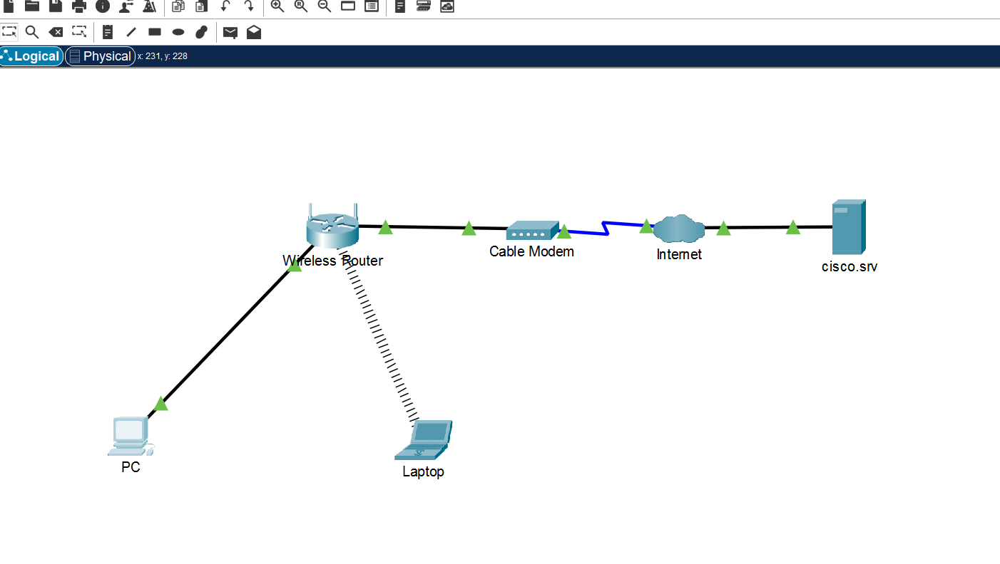

# 🌐 Laboratório 2 - Criar uma Rede Simples

Atividade prática realizada no **Cisco Packet Tracer**, com o objetivo de construir uma rede doméstica simples, conectar dispositivos por diferentes meios e verificar a comunicação entre eles.

---

## 📷 Topologia da Rede



---

## 🎯 Objetivos

- Criar uma rede simples no Logical Workspace
- Conectar dispositivos utilizando diferentes tipos de cabos
- Configurar um dispositivo para conexão Wi-Fi
- Obter endereçamento IP via DHCP
- Verificar a conectividade entre os dispositivos

---

## 🖥️ Dispositivos Utilizados

- PC
- Laptop
- Wireless Router
- Cable Modem
- Internet
- Servidor `cisco.srv`

### 🔌 Conexões

- **PC → Wireless Router:** cabo Ethernet (Copper Straight-Through)
- **Wireless Router → Cable Modem:** cabo Ethernet
- **Cable Modem → Internet:** cabo coaxial
- **Laptop → Wireless Router:** conexão Wi-Fi

---

## ⚙️ Configurações Realizadas

### PC

O PC foi conectado fisicamente ao roteador e configurado para obter automaticamente um endereço IP através do **DHCP**.

Foi utilizado:

```bash
ipconfig /all

### PC

O PC foi conectado fisicamente ao roteador e configurado para obter automaticamente um endereço IP através do **DHCP**.

Foi utilizado:

```bash
ipconfig /all
````
para verificar as informações de rede.

### Laptop

O módulo Ethernet foi substituído pelo módulo WPC300N, permitindo a conexão sem fio.

Após a instalação, o laptop foi conectado à rede Wi-Fi:

SSID: HomeNetwork

### Teste de conectividade

A comunicação com o servidor foi verificada utilizando:

```bash
ping cisco.srv
```
O acesso ao servidor também foi testado através do navegador Web do laptop.

## 🧠 Conceitos Praticados
Rede LAN e conexão Wi-Fi
DHCP
Endereço IPv4
Máscara de sub-rede
Gateway padrão
Conexões Ethernet e coaxial
NIC (Network Interface Card)
Comunicação entre dispositivos
Teste de conectividade com ping

## 📌 O que aprendi

Nesta atividade, pratiquei a criação de uma rede doméstica simples no Packet Tracer, entendendo como dispositivos podem se conectar ao roteador por meio de cabos Ethernet ou Wi-Fi.

Também pratiquei a obtenção automática de endereços IP através do DHCP e utilizei os comandos ipconfig e ping para verificar as configurações e a conectividade da rede.
