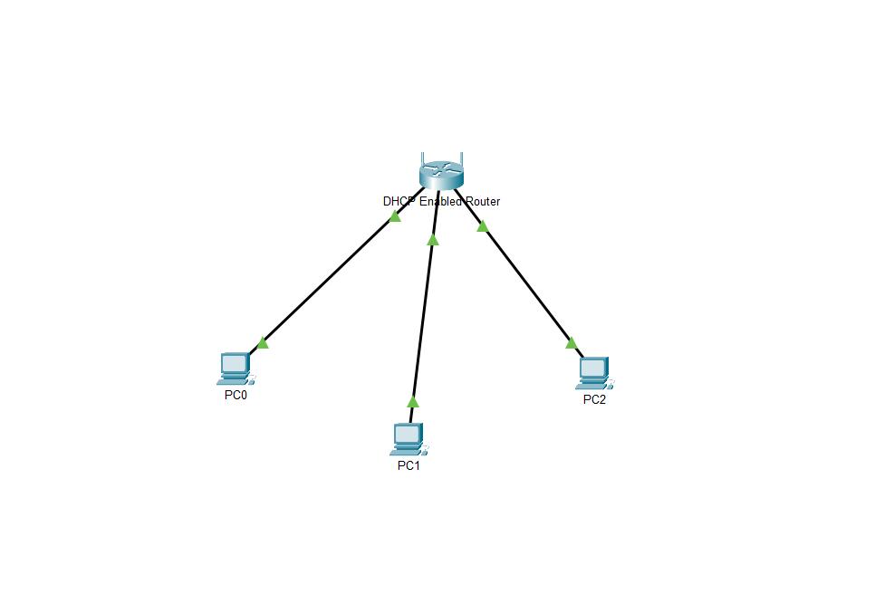
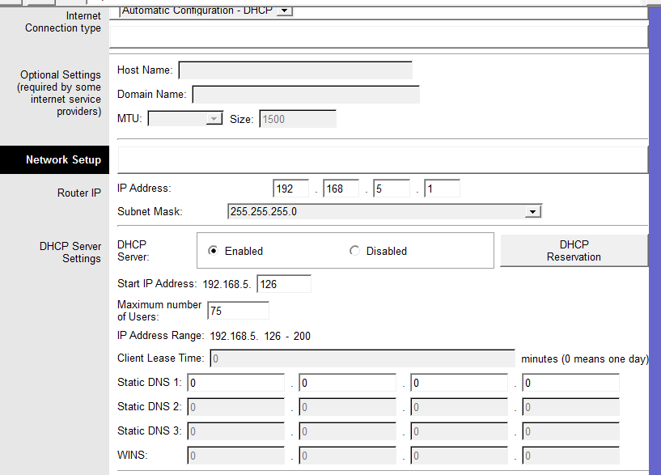

# 🌐 Laboratório 03 - Configuração de DHCP

Atividade prática do Cisco Packet Tracer para configurar o DHCP de um roteador wireless e permitir que dispositivos obtenham seus endereços IP automaticamente.

---

## 📷 Topologia

---

## 🎯 Objetivos

- Conectar três PCs a um roteador wireless
- Configurar o endereço IP do roteador
- Alterar a faixa de endereços DHCP
- Configurar os PCs para obter IP automaticamente
- Verificar a conectividade entre os dispositivos

---

## ⚙️ Configuração realizada

**Roteador Wireless**
- IP: `192.168.5.1`
- DHCP: habilitado
- IP inicial: `192.168.5.126`
- Máximo de usuários: `75`

---

## 🔎 Verificação

Os PCs foram configurados para obter seus endereços automaticamente através do DHCP.

A conectividade foi verificada utilizando `ipconfig` e `ping`.

---

## 🧠 Conceitos praticados

- DHCP
- Endereçamento IPv4
- Gateway padrão
- Configuração de roteador wireless
- Obtenção automática de endereço IP
- `ipconfig`
- `ping`

---

## 📚 O que aprendi

Nesta atividade, pratiquei a configuração do DHCP em um roteador wireless, alterando a rede utilizada e a faixa de endereços distribuídos aos clientes. Também verifiquei se os dispositivos receberam as configurações automaticamente e se conseguiam se comunicar entre si.
