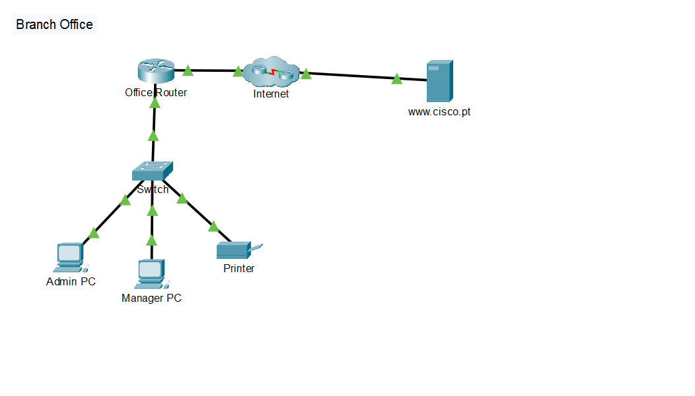

# 🌐 Laboratório 03 - Criando uma LAN

Atividade prática realizada no **Cisco Packet Tracer** para criação e configuração de uma LAN de uma pequena filial.

---

## 📷 Topologia



---

## 🎯 Objetivos

- Conectar dispositivos de rede e hosts
- Configurar endereçamento IPv4
- Utilizar DHCP e IP estático
- Verificar a conectividade da rede
- Utilizar comandos de diagnóstico

---

## 🛠️ Configuração

- **Admin PC:** IPv4 via DHCP
- **Manager PC:** IPv4 via DHCP
- **Printer:** IP estático `192.168.1.100`
- **Office Router:** fornece DHCP e conecta a LAN à Internet
- **Switch:** conecta os dispositivos da rede local

Rede utilizada: `192.168.1.0/24`

---

## 🔎 Testes

Foram utilizados os seguintes comandos para verificar a configuração e conectividade:

```bash
ipconfig
ipconfig /all
ping
tracert

```

Também foi realizado um teste de acesso ao servidor remoto através do navegador.

## 🧠 Conceitos Praticados
- LAN e endereçamento IPv4
- DHCP e IP estático
- Máscara de sub-rede e gateway
- DNS
- Ping e Tracert
- Conectividade entre redes

## 📚 O que aprendi

Pratiquei a criação de uma LAN, configuração de dispositivos com DHCP e IP estático e utilização de comandos de rede para verificar configurações e diagnosticar a conectividade.


## 📸 Prints

Para essa versão mais enxuta, eu colocaria **3 imagens além da topologia**:

- `topologia.png` → visão geral da rede
- `ipconfig.png` → mostra o endereçamento recebido pelo PC
- `ping.png` → comprova a conectividade
- `tracert.png` → mostra o caminho até a rede remota

Se quiser reduzir ainda mais, **topologia + ping + tracert** já seriam suficientes. Eu não colocaria print de cada configuração, porque o objetivo do README é documentar o laboratório sem transformar o repositório em uma cópia do enunciado.
