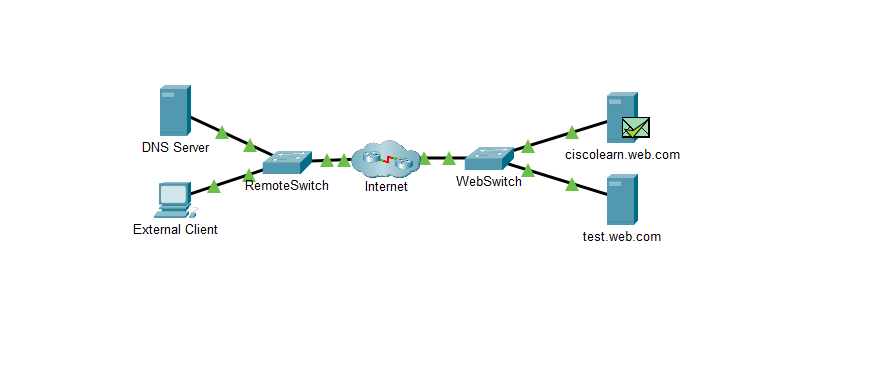
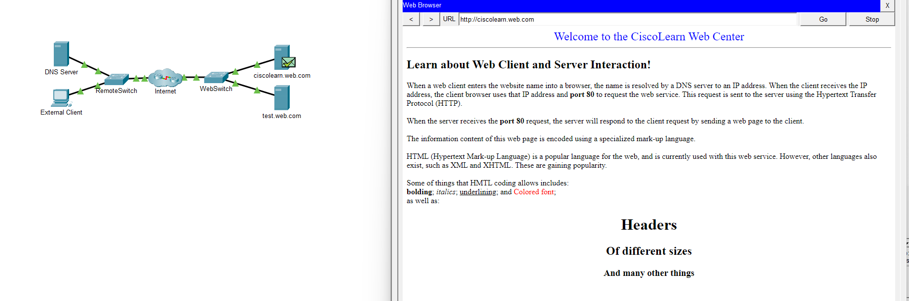
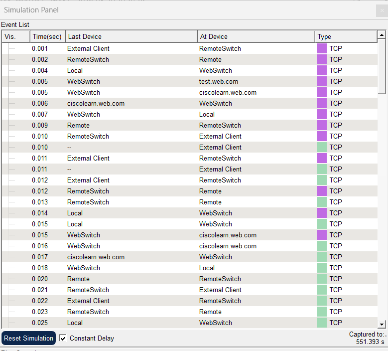

# 🌐 Laboratório 04 - Observando Solicitações Web

Atividade prática realizada no **Cisco Packet Tracer** para observar a comunicação entre um cliente e um servidor Web durante uma solicitação HTTP.

---

## 📷 Topologia




---

## 🎯 Objetivos

- Verificar a conectividade com um servidor Web
- Observar a resolução de nomes utilizando DNS
- Acessar uma página Web através de HTTP
- Visualizar o código HTML armazenado no servidor
- Observar o tráfego HTTP e TCP no Modo de Simulação

---

## 🌐 Acesso ao Servidor Web

A conectividade foi verificada utilizando:

```bash
ping ciscolearn.web.com
```

O endereço IP do servidor foi obtido através da resolução do nome de domínio pelo DNS.

Em seguida, o endereço ciscolearn.web.com foi acessado pelo navegador do External Client, permitindo visualizar a página hospedada no servidor.



## 📄 Código HTML

O arquivo index.html do servidor foi consultado para comparar o código HTML com a página exibida no navegador.

## 🔬 Modo de Simulação

Foi criada uma PDU complexa utilizando HTTP, com o External Client como origem e o servidor Web como destino.

No Modo de Simulação, foram observados os eventos gerados durante a comunicação TCP/HTTP.



## 🧠 Conceitos Praticados
- DNS e resolução de nomes
- HTTP
- TCP
- Cliente e servidor Web
- Endereço IP
- PDU
- Modo de Simulação
- Análise de eventos e tráfego de rede

## 📚 O que aprendi

Nesta atividade, pratiquei a observação de uma solicitação Web desde o cliente até o servidor, relacionando o nome de domínio, endereço IP, DNS, TCP e HTTP.

Também utilizei o Modo de Simulação para visualizar os eventos e entender o tráfego gerado durante a comunicação.

