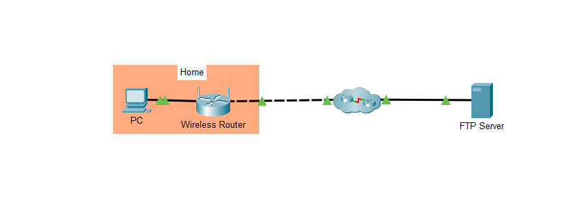
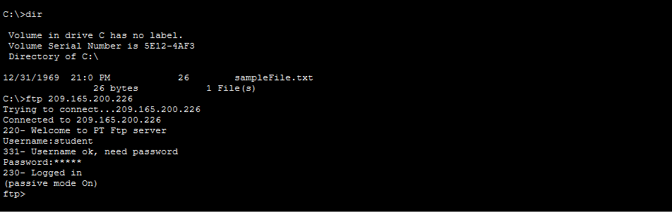
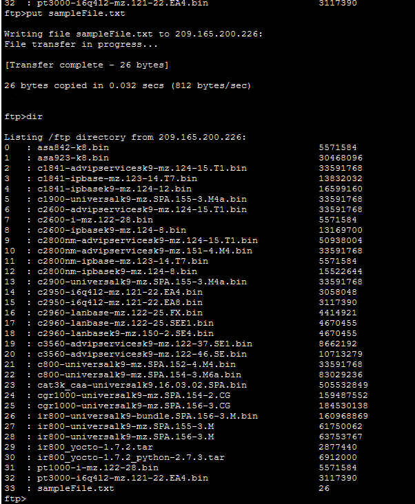
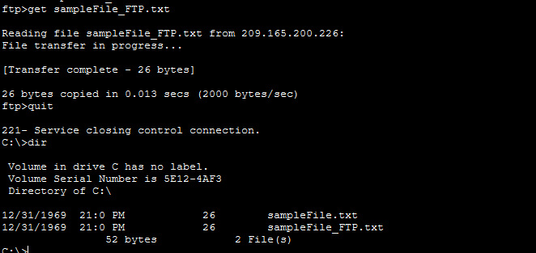

# 📁 Laboratório 05 - Usando Serviços FTP

Atividade prática realizada no **Cisco Packet Tracer** para explorar a comunicação entre um cliente e um servidor utilizando o **FTP (File Transfer Protocol)**.

---

## 📷 Topologia



---

## 🎯 Objetivos

- Conectar um cliente a um servidor FTP
- Realizar upload de arquivos
- Realizar download de arquivos
- Renomear e excluir arquivos no servidor
- Utilizar comandos FTP pelo Command Prompt

---

## 🔗 Conexão com o Servidor

O servidor FTP foi acessado pelo endereço:

```text
209.165.200.226
```
Também foi utilizado o domínio:

ftp.pka

Após a conexão, foi realizado login utilizando as credenciais fornecidas pela atividade.



## ⬆️ Upload

O arquivo sampleFile.txt, localizado no PC-A, foi enviado para o servidor utilizando:

```
put sampleFile.txt
```

A transferência foi verificada através do comando:
```
dir
```



## ⬇️ Download

O arquivo foi renomeado no servidor e posteriormente baixado para o PC utilizando:

```
get sampleFile_FTP.txt
```



## 🧠 Conceitos Praticados
- FTP
- Cliente e servidor
- Upload e download
- Transferência de arquivos
- Autenticação
- Command Prompt
- Comandos dir, put, get, rename e delete

## 📚 O que aprendi

Nesta atividade, pratiquei na prática o funcionamento de uma comunicação cliente-servidor utilizando FTP, realizando login e transferência de arquivos entre o PC e o servidor.

Também pude visualizar como comandos enviados pelo cliente podem consultar, enviar, baixar, renomear e excluir arquivos no servidor.


```markdown
## 💻 Comandos utilizados

| Comando | Função |
| `ftp`   | Conecta ao servidor FTP |
| `dir`   | Lista os arquivos |
| `put`   | Envia um arquivo |
| `get`   | Baixa um arquivo |
| `rename`| Renomeia um arquivo |
| `delete`| Exclui um arquivo |
| `quit`  | Encerra a conexão |

```
