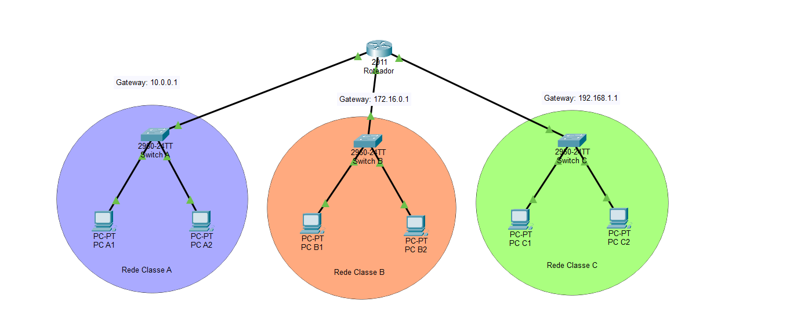
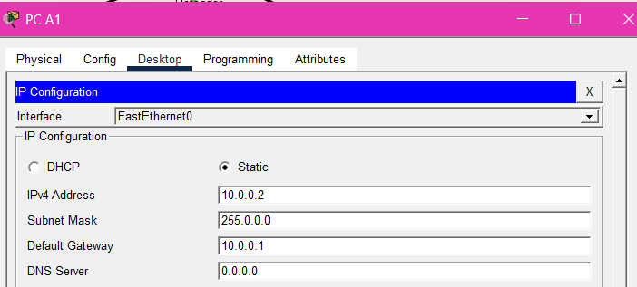
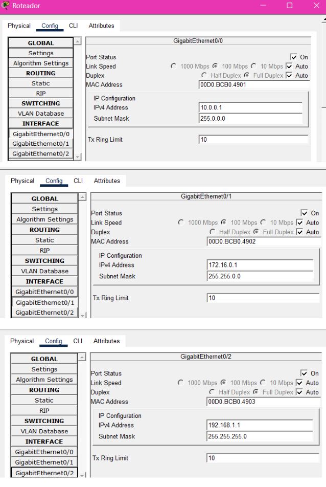
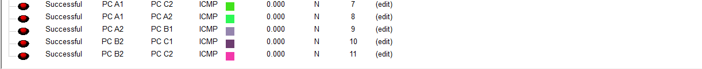

# 🌐 Comunicação entre 3 Redes Distintas no Cisco Packet Tracer

Laboratório desenvolvido em grupo durante o curso **"Começando com o Cisco Packet Tracer"** no programa **Mulher Digital**, utilizando o Packet Tracer para simular a comunicação entre três redes distintas por meio de um roteador.

A atividade foi realizada como um **checkpoint de aprendizagem**, com o objetivo de avaliar os conhecimentos adquiridos até o momento do curso. Além da construção e configuração da rede, o grupo desenvolveu um vídeo tutorial, slides explicativos e um roteiro para apresentar cada etapa de forma didática.

## 📷 Topologia da Rede



## 🎯 Objetivo

Criar uma topologia de rede composta por:

* 1 roteador Cisco 2911;
* 3 switches Cisco 2960;
* 6 computadores;
* 3 redes IPv4 distintas;
* Conexões entre os dispositivos utilizando cabo Copper Straight-Through.

O objetivo foi configurar o roteador e os computadores para permitir a comunicação entre as três redes.

## 🛠️ Estrutura das Redes

| Rede   | Endereçamento    | Gateway       |
| ------ | ---------------- | ------------- |
| Rede A | `10.0.0.0/8`     | `10.0.0.1`    |
| Rede B | `172.16.0.0/16`  | `172.16.0.1`  |
| Rede C | `192.168.1.0/24` | `192.168.1.1` |



### Dispositivos

* **Rede A:** PC A1 e PC A2;
* **Rede B:** PC B1 e PC B2;
* **Rede C:** PC C1 e PC C2;
* **Roteador:** responsável pela comunicação entre as redes;
* **Switches:** responsáveis pela conexão dos dispositivos dentro de cada rede.

## ⚙️ Desenvolvimento da Atividade

Durante a prática, foram realizadas as seguintes etapas:

1. Adição e identificação do roteador, switches e computadores;
2. Organização da topologia no modo lógico do Packet Tracer;
3. Conexão do roteador aos três switches;
4. Conexão dos computadores aos respectivos switches;
5. Configuração dos endereços IPv4 dos computadores;
6. Configuração das interfaces GigabitEthernet do roteador;
7. Definição dos gateways de cada rede;
8. Verificação da comunicação entre dispositivos de redes diferentes.

### Configuração das interfaces do roteador

| Interface          | Endereço IPv4 |
| ------------------ | ------------- |
| GigabitEthernet0/0 | `10.0.0.1`    |
| GigabitEthernet0/1 | `172.16.0.1`  |
| GigabitEthernet0/2 | `192.168.1.1` |



## 🧪 Verificação da Conectividade

A comunicação foi verificada por meio de testes de conectividade entre computadores pertencentes a redes diferentes.

Exemplos de testes realizados:

```text
ping 172.16.0.2
ping 192.168.1.2
```

Esses testes permitiram verificar se o roteador estava encaminhando corretamente os pacotes entre as redes A, B e C.



## 🤝 Desenvolvimento em Grupo

A atividade foi desenvolvida de forma colaborativa. O grupo organizou as responsabilidades para que todas as integrantes participassem da produção e da apresentação.

Entre as tarefas realizadas, estiveram:

* Separação e organização das etapas da atividade;
* Construção e configuração da topologia;
* Criação dos slides explicativos;
* Preparação de uma explicação clara e didática sobre cada etapa.
* Gravação do vídeo tutorial com a participação das integrantes;

A proposta foi trabalhar em equipe, garantindo que todas as integrantes contribuíssem para o desenvolvimento e a apresentação do projeto.

## 🧠 Conceitos Praticados

* Redes IPv4;
* Endereçamento de dispositivos;
* Comunicação entre redes distintas;
* Função do roteador;
* Função dos switches;
* Interfaces GigabitEthernet;
* Conexões;
* Testes de conectividade com `ping`;
* Organização de uma topologia de rede;
* Trabalho em equipe e comunicação técnica.

## 🎥 Apresentação do Projeto

O grupo produziu um vídeo tutorial e slide com a explicação da atividade, incluindo introdução, desenvolvimento dos passos, explicações técnicas e conclusão.

Por conter a imagem de várias participantes, o vídeo não foi disponibilizado publicamente neste repositório.

## 📌 O que aprendi

Com esta atividade, pude reforçar os conhecimentos sobre endereçamento IPv4, gateways e comunicação entre redes distintas. Pude compreender como configurar uma rede, explicando seu funcionamento de maneira clara e didática.

Também desenvolvi habilidades de trabalho em equipe, organização de tarefas e comunicação técnica, participando da criação do vídeo tutorial. 
