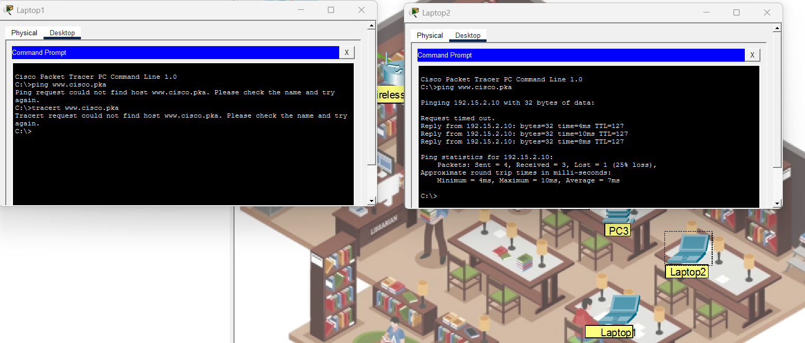
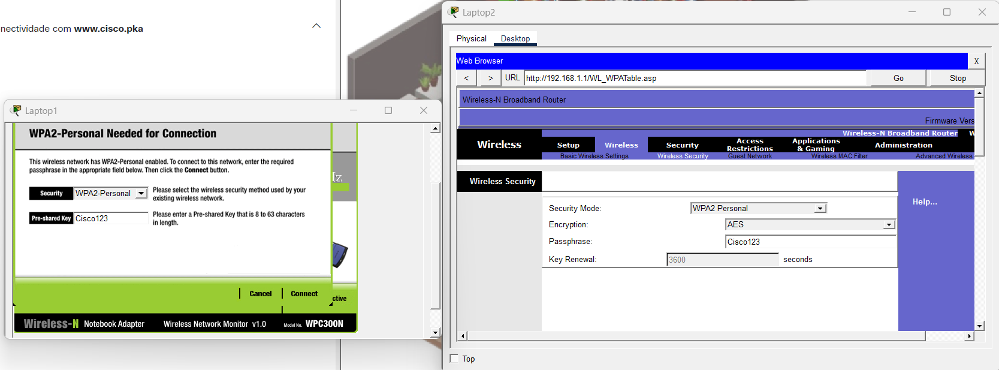
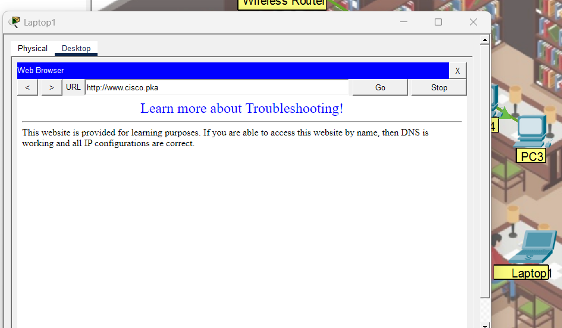

# 📶 Solucionar Problemas de uma Conexão Wireless

Atividade prática realizada no Cisco Packet Tracer, durante o curso **Segurança de Endpoint**, com o objetivo de identificar e corrigir uma falha de conectividade em uma rede sem fio.

## 📷 Topologia

## 🎯 Objetivos

- Identificar falhas em uma rede sem fio.
- Corrigir dispositivos configurados incorretamente.
- Testar a conectividade antes e depois da correção.
- Utilizar ferramentas de diagnóstico de rede.

## 🔎 Problema identificado

Em uma biblioteca, o **Laptop1** não conseguia acessar a Internet, enquanto os demais dispositivos apresentavam conectividade.

O objetivo foi investigar a origem do problema, corrigir a configuração da conexão sem fio e verificar se o acesso ao site `www.cisco.pka` havia sido restabelecido.

## 🛠️ Prática realizada

Durante a solução do problema, foram realizados:

- Testes de conectividade entre os dispositivos.
- Comparação entre um laptop com problema e outro com conectividade.
- Uso do comando `ping`.
- Uso do comando `tracert` para auxiliar na análise.
- Consulta das configurações de rede com `ipconfig`.
- Identificação do gateway padrão para localizar o roteador sem fio.
- Conexão do Laptop1 à rede wireless.
- Teste final de acesso ao `www.cisco.pka`.

## 🧪 Verificação

Inicialmente, o Laptop1 apresentou falha de conectividade, enquanto outro dispositivo da rede conseguiu acessar o destino.

Após conectar o Laptop1 corretamente à rede sem fio, foi realizado um novo teste utilizando o navegador, confirmando o acesso ao `www.cisco.pka`.

### Teste de conectividade

### Conexão à rede wireless

### Teste após a correção

## 🧠 Conceitos praticados

- Redes sem fio
- Conectividade de rede
- DHCP e endereçamento IP
- Gateway padrão
- Roteador wireless
- `ping`
- `tracert`
- `ipconfig`
- Diagnóstico e solução de problemas de rede

## 📌 O que aprendi

Esta atividade ajudou a compreender melhor o processo de **troubleshooting de uma rede**, mostrando a importância de investigar o problema por etapas antes de realizar uma correção.

Também pude colocar em prática o uso de ferramentas como `ping`, `tracert` e `ipconfig` para identificar problemas de conectividade e validar a solução.

A atividade reforçou a importância de analisar diferentes possibilidades durante a resolução de um problema de rede e verificar o resultado após a correção.

## 📁 Arquivo da atividade

- `atividade.pka` — arquivo da atividade realizada no Cisco Packet Tracer.
